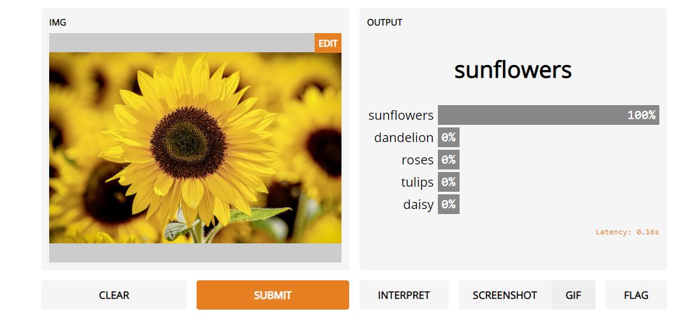
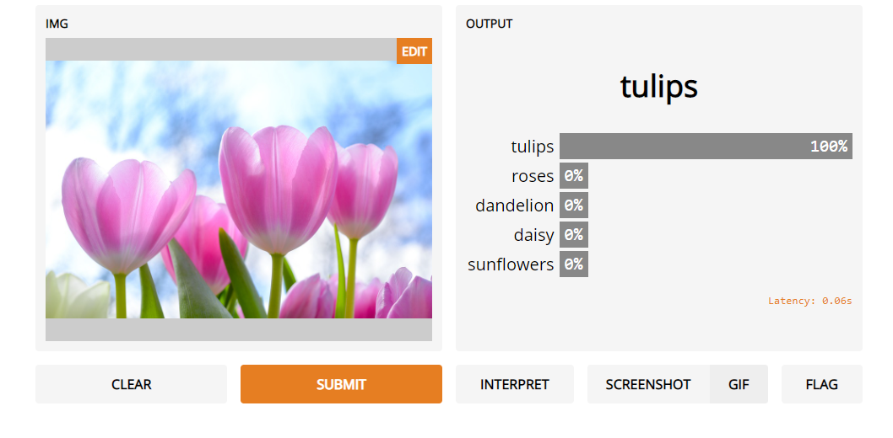

## FlowerClassification-GRADIO

Using a CNN on flower dataset opensourced by tensorflow, we created a model for flower classification.After 30 epochs, we are having a 100% accuracy to predict flowers into 5 different classes.

### Test of Sunflower:

### Test of Tulips:

